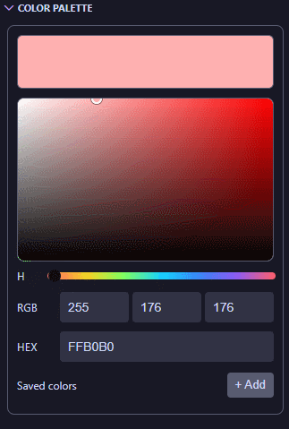

# Color Palette

A VS Code extension that provides a color picker directly inside the Explorer sidebar.

## Features

- Sidebar-integrated color picker (no separate editor tab required)
- HSV-based color selection with interactive controls
- RGB and HEX input support
- Save colors with `+ Add`
- Click a saved color to apply it instantly
- Right-click a saved color to delete it (`Delete` context menu)

## Usage

1. Open the **Explorer** view in VS Code.
2. Find the **Color Palette** view.
3. Pick a color using the controls or enter RGB/HEX values directly.
4. Click **+ Add** to save the current color.
5. Click a saved color chip to reapply it.
6. Right-click a saved chip and choose **Delete** to remove it.

## Data Storage

Saved colors are stored in VS Code extension `globalState`.
